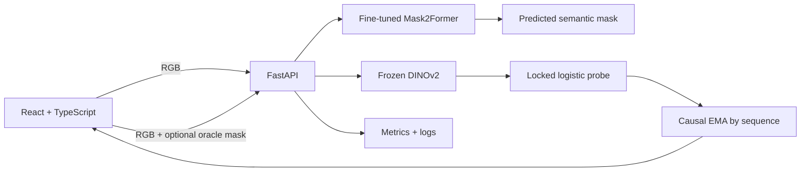

# Phase VIII — Integrated road-scene demonstrator

This repository combines the locked Phase VI Virtual KITTI 2 weather experiment with the
fine-tuned Phase VII KITTI semantic-segmentation model. It does **not** retrain either model.

## Locked scientific contract

| Component | Phase VI lock used by the app |
|---|---|
| Representation | Frozen DINOv2 `vit_small_patch14_dinov2.lvd142m` |
| Classifier | Serialized multinomial logistic-regression pipeline |
| Region | `semantic_sky` from the VKITTI2 colour ground truth |
| Classes | `clone`, `fog`, `rain` |
| Temporal method | Causal EMA, α = 0.6 |
| Test protocol | Scene18 selection → one-time Scene20 evaluation |
| Locked Scene20 macro-F1 | 0.9996 (2,511 frames) |

The result above is an experimental benchmark, not an expected real-world performance
claim. The model needs an oracle semantic mask and has not been validated for live road use.

## Architecture



- `backend/`: typed FastAPI API, artifact checks, DINOv2 inference, EMA state, metrics
- `frontend/`: responsive React/TypeScript interface
- `.github/workflows/`: automated tests and Azure deployment
- `infra/`: Azure bootstrap helper
- `docs/`: deployment, monitoring, and thesis-ready LaTeX section

## Run the real Phase VI model

1. Download the canonical release:

   ```bash
   gcloud storage cp \
     gs://thesis_weather_storage/phase6/releases/phase6_vkitti2_temporal_v4_1_release.tar.gz \
     /tmp/phase6-release.tar.gz
   tar -xzf /tmp/phase6-release.tar.gz -C backend/artifacts
   ```

2. Place the three uploaded Mask2Former files in:

   ```text
   backend/artifacts/mask2former_kitti_best/
   ├── config.json
   ├── preprocessor_config.json
   └── model.safetensors
   ```

3. Start the two containers:

   ```bash
   cp .env.example .env
   docker compose up --build
   ```

4. Open `http://localhost:8080`. The OpenAPI interface is at
   `http://localhost:8000/docs`.

DINOv2 weights are cached in the API image during the build, so the first image build is
large and slower than later cached builds.

## Technical smoke test without model artifacts

The mock mode only verifies API/UI integration. It must never be used for thesis metrics:

```bash
MODEL_MODE=mock docker compose up --build
```

## Local tests

```bash
python -m venv .venv
. .venv/bin/activate
pip install -e "backend[dev]"
ruff check backend/app backend/tests
pytest -q backend/tests

cd frontend
npm ci
npm run build
```

## API

- `GET /health/live`: process liveness
- `GET /health/ready`: model/artifact readiness
- `GET /api/v1/model`: exact deployed model contract and limitation
- `GET /api/v1/segmentation/model`: deployed Mask2Former contract
- `POST /api/v1/segment/semantic`: RGB image to colour mask, overlay, and class areas
- `POST /api/v1/predict/frame`: RGB + matching semantic mask + sequence identifier
- `DELETE /api/v1/sequences/{sequence_id}`: reset causal state
- `GET /metrics`: Prometheus-format operational metrics

The prediction endpoint accepts an optional abstention threshold. It returns raw and
EMA-smoothed class probabilities, confidence, entropy, frame index, and inference latency.

Test semantic segmentation directly from the generated OpenAPI page, or with:

```bash
curl -X POST http://localhost:8000/api/v1/segment/semantic \
  -F 'rgb=@road_scene.png' > semantic_result.json
```

The two PNG fields in the JSON response are base64-encoded. They can be rendered directly
in the frontend as `data:image/png;base64,...` URLs.

## Deployment status

The repository contains a current Azure Container Apps workflow, but an actual cloud
deployment requires the user's Azure/GCP identities and is not claimed by this release.
See [docs/deployment.md](docs/deployment.md).

## Reproducibility and limitations

- Release hashes are checked when `release_manifest_v4_1.json` is present.
- Images are processed in memory and are not persisted.
- EMA state is in memory; Azure is therefore limited to one API replica in this version.
- A real-world extension must replace the oracle mask with predicted segmentation and be
  evaluated on independent real driving videos before any safety claim.
